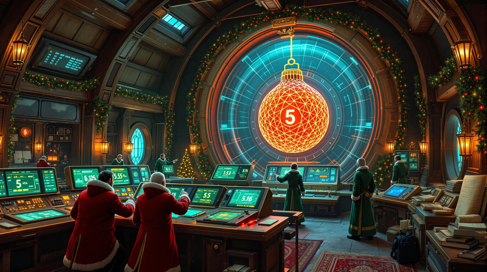

# Advent of Code 2024

Solutions for Advent of Code 2024 in rust 🦀 With benchmarks and AI generated pictures for each day.

<!-- BENCHMARKS -->
## Benchmarks
Ran on MacBook Pro M1 Max 2021 with 32GB RAM and 10 cores.
Benchmarks done with [criterion](https://github.com/bheisler/criterion.rs), using 200 samples per benchmark.

| Solution | Min (-%) | Median | p95 (+%) | p99 (+%) |
|----------|----------|---------|-----------|----------|
| Day 01, Part 1 | 47.74 µs (-5%) | 50.18 µs | 96.49 µs (+92%) | 165.21 µs (+229%) |
| Day 01, Part 2 | 70.04 µs (-3%) | 72.04 µs | 118.40 µs (+64%) | 178.84 µs (+148%) |
| Day 02, Part 1 | 68.16 µs (-4%) | 70.97 µs | 112.82 µs (+59%) | 192.61 µs (+171%) |
| Day 02, Part 2 | 82.33 µs (-5%) | 86.08 µs | 146.80 µs (+71%) | 222.37 µs (+158%) |

<!-- BENCHMARKS_END -->

### Day 1

### Day 2

